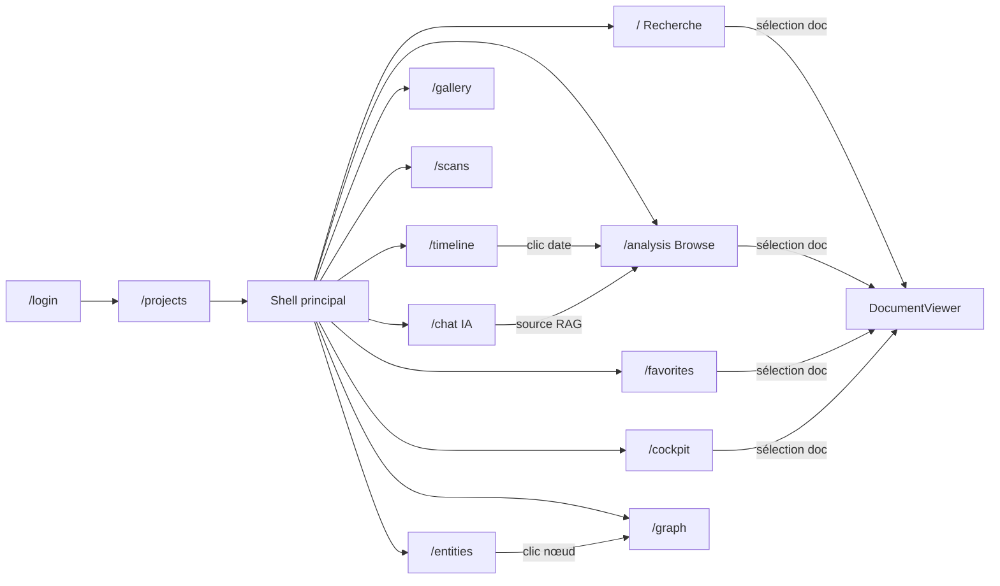

# Audit UX/UI — Tous les écrans Archon

Audit approfondi avec **schéma de layout**, **analyse critique** et **propositions de redesign** pour chaque écran.

---

## Carte de navigation



> [!IMPORTANT]
> **12 écrans** + 1 shell global. Beaucoup de redondance entre `/` (Recherche), `/analysis` (Browse), et `/cockpit`. L'utilisateur a **3 façons d'arriver au même DocumentViewer**, ce qui peut être déroutant.

---

## 1. Login (`/login`)

### Layout actuel

```
┌─────────────────────────────────────────┐
│            (fond gradient)              │
│                                         │
│        🛡️ ARCHON                        │
│        Investigation numérique          │
│                                         │
│     ┌───────────────────────┐           │
│     │ Username              │           │
│     ├───────────────────────┤           │
│     │ Password        👁️    │           │
│     ├───────────────────────┤           │
│     │    [ Sign In ]        │           │
│     └───────────────────────┘           │
│     Don't have an account? Register ›   │
│                                         │
└─────────────────────────────────────────┘
```

### 🔴 Problèmes identifiés

| #   | Problème                                                      | Impact                                                   |
| --- | ------------------------------------------------------------- | -------------------------------------------------------- |
| 1   | **Libellés en dur** ("Sign In", "Username") — pas i18n        | L'app est bilingue FR/EN partout sauf ici                |
| 2   | **Pas d'aria-live** sur le message d'erreur                   | Accessibilité — lecteurs d'écran ignorent l'erreur       |
| 3   | **Design générique** — centré minimaliste sans identité forte | Première impression banale pour un outil d'investigation |
| 4   | **Pas de "mot de passe oublié"**                              | Flow incomplet (mineur si usage interne)                 |

### 💡 Challenge design

> Le login est la **porte d'entrée** — c'est le premier écran vu par l'utilisateur. Un outil d'investigation forensique devrait donner une impression de **puissance et sécurité**, pas de formulaire Bootstrap.

**Proposition** : split-screen asymétrique avec une illustration/animation forensique côté gauche (graphe de connexions, scan en cours), formulaire minimaliste côté droit. Effet glassmorphism sur le card. Motif grille subtil en fond.

---

## 2. Projets / Dashboard (`/projects`)

### Layout actuel

```
┌────────────────────────────────────────────────────────────┐
│ Header : ARCHON · Investigation numérique       [👤 user] │
├────────────────────────────────────────────────────────────┤
│                                                            │
│  [+ Nouveau projet]                                        │
│                                                            │
│  ┌──────────────┐  ┌──────────────┐  ┌──────────────┐     │
│  │ 📁 Projet A  │  │ 📁 Projet B  │  │ 📁 Projet C  │     │
│  │ 1.2M fichiers│  │ 340K fichiers│  │ (vide)       │     │
│  │ Dernier scan │  │ En cours...  │  │ [Scanner]    │     │
│  │ [⋮]          │  │ ████████ 67% │  │ [⋮]          │     │
│  └──────────────┘  └──────────────┘  └──────────────┘     │
│                                                            │
│  ┌─────────── ScanConfigPanel (dialog) ───────────┐       │
│  │ Path: /data/evidence/...                        │       │
│  │ Estimation: 45,230 fichiers · 12.4 GB           │       │
│  │ [x] Activer embeddings ($0.02 estimé)           │       │
│  │ [ Lancer le scan ]                              │       │
│  └─────────────────────────────────────────────────┘       │
└────────────────────────────────────────────────────────────┘
```

### 🔴 Problèmes identifiés

| #   | Problème                                                                                                     | Impact                            |
| --- | ------------------------------------------------------------------------------------------------------------ | --------------------------------- |
| 1   | **Trop de responsabilités** : liste projets + scans + config + progression dans un seul écran de 1075 lignes | Complexité cognitive, maintenance |
| 2   | **Cards de projet non standardisées** : contenu variable (scan en cours vs. terminé vs. vide)                | Incohérence visuelle              |
| 3   | **Actions destructives** (supprimer projet) sans détail de ce qui sera perdu                                 | Risque d'erreur                   |
| 4   | **Pas de feedback visuel** entre "je clique" et "je suis dans le projet"                                     | Transition abrupte                |

### 💡 Challenge design

> Le dashboard devrait être une **war room** : voir d'un coup d'œil l'état de tous les projets. Actuellement c'est une grille de cards standards.

**Propositions** :

- **Mini-dashboard par projet** : sparkline d'activité de scan, barre de complétion circulaire, dernier document scanné
- **Transition animée** : quand l'utilisateur clique sur un projet, le card s'expand en plein écran avant de révéler le shell
- **Statut coloré** : bordure verte (complété), orange (en cours), gris (vide), rouge (erreur)

---

## 3. Recherche (`/` — HomePage)

### Layout actuel

```
┌──────── 40% ────────┬─── resize ───┬──────── 60% ────────┐
│ SearchBar            │              │                      │
│ [🔍 query  ] [Mode] │              │ DocumentViewer        │
├──────────────────────┤              │                      │
│ ❌ Erreur + Réessayer│      ║       │ Breadcrumb            │
├──────────────────────┤      ║       │ ┌──────────────────┐ │
│ 🔍 Scan Avancé (IA) │      ║       │ │ PDF / Image / Txt│ │
├──────────────────────┤      ║       │ │                  │ │
│ ResultList           │      ║       │ │ EntityPanel      │ │
│ • doc1.pdf  0.95     │      ║       │ │ DeepAnalysisPanel│ │
│ • doc2.txt  0.87     │      ║       │ │                  │ │
│ • doc3.pdf  0.82     │      ║       │ │ [Content]        │ │
│   ...                │      ║       │ │                  │ │
│ [Load more]          │              │ └──────────────────┘ │
└──────────────────────┴──────────────┴──────────────────────┘
```

### 🔴 Problèmes identifiés

| #   | Problème                                                             | Impact                                                             |
| --- | -------------------------------------------------------------------- | ------------------------------------------------------------------ |
| 1   | **Pas de preview inline** dans les résultats (juste snippet texte)   | L'utilisateur doit cliquer pour "voir" → beaucoup d'allers-retours |
| 2   | **Score affiché comme nombre brut** (0.87) — pas interprétable       | L'utilisateur ne sait pas si 0.87 = bon ou mauvais                 |
| 3   | **Bouton "Scan Avancé" mal positionné** — entre erreurs et résultats | Risque d'être ignoré ou de casser le flow visuel                   |
| 4   | **Pas de filtres visibles** dans le résultat (type, date, taille)    | L'utilisateur doit deviner les facettes                            |
| 5   | **Panneau droit vide avant sélection** — espace gaspillé             | La moitié de l'écran est inutile au démarrage                      |

### 💡 Challenge design

> C'est l'écran le plus important — le cœur de l'investigation. Il devrait être au niveau d'**Algolia InstantSearch** ou **Elasticsearch Discover**.

**Propositions** :

- **Thumbnails dans les résultats** : petite preview (50px) à gauche de chaque résultat pour identifier visuellement
- **Score visuel** : barre de pertinence colorée (vert → rouge) au lieu du chiffre brut
- **Filtres latéraux** : facettes permanentes (type, date, taille) dans un sidebar pliable
- **Panneau vide → panneau statistiques** : quand aucun doc n'est sélectionné, afficher un résumé des résultats (répartition par type, timeline miniature, top entités)
- **"Scan Avancé"** déplacé en bas des résultats ou dans un footer sticky

---

## 4. Exploration / Browse (`/analysis`)

### Layout actuel

```
┌──────── 40% ────────┬─── resize ───┬──────── 60% ────────┐
│ Context line         │              │                      │
│ Projet · N docs      │              │ DocumentViewer        │
├──────────────────────┤              │                      │
│ Filtres : [type]     │      ║       │ (même que Recherche)  │
│ [date] [tri] [search]│      ║       │                      │
├──────────────────────┤      ║       │                      │
│ Présets : [7j] [30j] │      ║       │                      │
├──────────────────────┤      ║       │                      │
│ Grille documents     │      ║       │                      │
│ ┌────┐ ┌────┐ ┌────┐│      ║       │                      │
│ │doc1│ │doc2│ │doc3││      ║       │                      │
│ └────┘ └────┘ └────┘│              │                      │
└──────────────────────┴──────────────┴──────────────────────┘
```

### 🔴 Problèmes identifiés

| #   | Problème                                                                              | Impact                                                |
| --- | ------------------------------------------------------------------------------------- | ----------------------------------------------------- |
| 1   | **Quasi-doublon de `/`** : même split view, même DocumentViewer                       | Confusion "c'est quoi la différence ?"                |
| 2   | **Trop de filtres** au-dessus (type + date + présets + tri + recherche) = 5 contrôles | Surcharge cognitive                                   |
| 3   | **Grille vs. Liste** : pas de toggle entre les 2 modes d'affichage                    | Préférence utilisateur ignorée                        |
| 4   | **Pas de groupement intelligent** : les docs sont "en vrac"                           | Manque de structure (par dossier, par date, par type) |

### 💡 Challenge design

> L'exploration devrait être un **file browser intelligent** avec des vues multiples — pas une deuxième page de recherche.

**Propositions** :

- **Fusionner avec `/cockpit`** ou différencier clairement (Browse = navigation par dossier, Cockpit = investigation avec contexte)
- **Toggle vue** : grille / liste / timeline
- **Tree view latérale** : arborescence des dossiers scannés
- **Groupement auto** : regrouper par date (avec séparateurs "Décembre 2024"), type, ou dossier

---

## 5. Cockpit (`/cockpit`)

### Layout actuel

```
┌──── 256px ────┬──── 384px ────┬──── flex-1 ────────────┐
│ FilterPanel   │ ResultList    │ DocumentViewer           │
│               │               │                          │
│ Query         │ • result 1    │ PDF / Image / Text        │
│ Semantic wt   │ • result 2    │                          │
│ File types    │ • result 3    │ EntityPanel              │
│ Date range    │               │ DeepAnalysisPanel        │
│               │               │                          │
│ [Rechercher]  │               │                          │
├───────────────┴───────────────┴──────────────────────────┤
│                    MetadataBar (h-12)                     │
└──────────────────────────────────────────────────────────┘
```

### 🔴 Problèmes identifiés

| #   | Problème                                                                                     | Impact                                             |
| --- | -------------------------------------------------------------------------------------------- | -------------------------------------------------- |
| 1   | **Troisième écran de recherche** avec le même DocumentViewer                                 | Pourquoi 3 façons de chercher ?                    |
| 2   | **Layout 3 colonnes fixes** : pas responsive, la colonne filtres a une largeur fixe de 256px | Gaspillage d'espace sur petits écrans              |
| 3   | **MetadataBar en bas** (h-12) — contenu quasi invisible                                      | 48px de barre en bas, l'utilisateur ne la voit pas |
| 4   | **Pas de deep link** : les filtres ne sont pas dans l'URL                                    | Impossible de partager un état de cockpit          |

### 💡 Challenge design

> Le Cockpit devrait être la **vue d'investigation avancée** — celle que l'analyste utilise quand il a un objectif précis. Sinon, le fusionner avec la recherche.

**Propositions** :

- **Différenciation claire** : le cockpit devrait avoir des outils que la recherche n'a pas (timeline miniature, graphe contextuel, comparaison de documents)
- **Ou fusion** : absorber les filtres du cockpit dans la SearchBar de `/` et supprimer `/cockpit`
- **MetadataBar** : transformer en panneau contextuel enrichi (entités communes, timeline, annotations) plutôt qu'une barre de 48px

---

## 6. Timeline (`/timeline`)

### Layout actuel

```
┌────────────────────────────────────────────────────────┐
│ Stats : N docs · M périodes · Début–Fin                │
├────────────────────────────────────────────────────────┤
│ Décennies : [1990] [2000] [2010] [2020]               │
├────────────────────────────────────────────────────────┤
│                                                        │
│  Heatmap (mois par mois)                               │
│  ┌──┬──┬──┬──┬──┬──┬──┬──┬──┬──┬──┬──┐                │
│  │J │F │M │A │M │J │J │A │S │O │N │D │  2023          │
│  │█ │░ │░ │██│██│░ │░ │░ │██│█ │░ │░ │                │
│  └──┴──┴──┴──┴──┴──┴──┴──┴──┴──┴──┴──┘                │
│                                                        │
│  ┌─── Documents du 15 mars 2023 (12 docs) ───┐        │
│  │ doc1.pdf · doc2.txt · doc3.jpg             │        │
│  │ [Ouvrir dans l'analyse →]                  │        │
│  └────────────────────────────────────────────┘        │
└────────────────────────────────────────────────────────┘
```

### 🟡 Analyse

| #   | Observation                                                                 | Verdict               |
| --- | --------------------------------------------------------------------------- | --------------------- |
| 1   | **Heatmap bien conçue** — navigation par décennies, clic sur date           | ✅ Bon                |
| 2   | **Pas de retry** sur erreur API                                             | ❌ À corriger         |
| 3   | **Pas de zoom** : on voit toute l'année, pas possible de zoomer sur un mois | Amélioration possible |
| 4   | **Carte de détail limitée** : juste liste de noms + CTA                     | Manque de contexte    |

### 💡 Challenge design

**Propositions** :

- **Zoom progressif** : décennie → année → mois → jour
- **Carte enrichie** : preview miniature des premiers documents, top entités de cette période
- **Intégration timeline dans la recherche** : afficher une mini-timeline au-dessus des résultats

---

## 7. Chat IA (`/chat`)

### Layout actuel

```
┌────────────────────────────────────────────────────────┐
│ Header : Chat IA · [RAG activé] · [🗑️ Effacer]       │
├────────────────────────────────────────────────────────┤
│                                                        │
│  Empty state:                                          │
│  "Posez une question..."                               │
│  [Suggestion 1] [Suggestion 2]                         │
│  [Suggestion 3] [Suggestion 4]                         │
│                                                        │
│  ── Messages ──                                        │
│  👤 "Qui est mentionné dans les doc de 2023 ?"         │
│  🤖 "D'après les documents, les personnes..."          │
│     📄 Documents utilisés (3)                           │
│     │ rapport.pdf — relevance: 0.92                    │
│     │ email_05.txt — relevance: 0.85                   │
│                                                        │
├────────────────────────────────────────────────────────┤
│ [💬 Message...                              ] [Envoyer]│
└────────────────────────────────────────────────────────┘
```

### 🔴 Problèmes identifiés

| #   | Problème                                             | Impact                                                           |
| --- | ---------------------------------------------------- | ---------------------------------------------------------------- |
| 1   | **Documents RAG non cliquables**                     | L'utilisateur ne peut pas vérifier la source → confiance réduite |
| 2   | **Pas de layout split** : tout est en colonne simple | Sur grand écran, beaucoup d'espace perdu                         |
| 3   | **Historique perdu au refresh**                      | Pas de persistance des conversations                             |
| 4   | **Pas de multi-conversation**                        | Une seule session, pas de tabs/historique                        |

### 💡 Challenge design

> Le chat IA devrait être au niveau de **ChatGPT** ou **Perplexity** en termes d'UX — avec citations interactives.

**Propositions** :

- **Citations inline** : les documents référencés apparaissent comme des `[1]` cliquables dans le texte, avec popover preview
- **Split view optionnelle** : chat à gauche, document preview à droite (comme Perplexity)
- **Multi-conversations** : sidebar avec historique des sessions
- **Streaming amélioré** : skeleton "thinking" animé pendant la génération

---

## 8. Galerie (`/gallery`)

### Layout actuel

```
┌────────────────────────────────────────────────────────┐
│ 🖼️ Galerie (234+)     [🔍 Recherche OCR      ]        │
├────────────────────────────────────────────────────────┤
│                                                        │
│  ┌─────┐  ┌─────┐  ┌─────┐  ┌─────┐  ┌─────┐        │
│  │  📷 │  │  📷 │  │  📷 │  │  📷 │  │  📷 │        │
│  │     │  │     │  │     │  │     │  │     │        │
│  └─────┘  └─────┘  └─────┘  └─────┘  └─────┘        │
│  ┌─────┐  ┌─────┐  ┌─────┐  ┌─────┐                  │
│  │  📷 │  │  🎥 │  │  📷 │  │  📷 │                  │
│  └─────┘  └─────┘  └─────┘  └─────┘                  │
│                                                        │
│  ⏳ Loading more...                                     │
└────────────────────────────────────────────────────────┘
```

### 🟡 Analyse

| #   | Observation                                        | Verdict                      |
| --- | -------------------------------------------------- | ---------------------------- |
| 1   | **Grille propre** avec infinite scroll             | ✅ Bon                       |
| 2   | **Pas de lightbox** — cliquer ne fait rien d'utile | ❌ Critique                  |
| 3   | **Pas de filtres** (vidéo vs. image, taille, date) | Manque                       |
| 4   | **Pas de lien avec le DocumentViewer**             | Déconnecté du reste de l'app |

### 💡 Challenge design

**Propositions** :

- **Lightbox fullscreen** : clic sur image → vue plein écran avec navigation ← →, OCR text overlay, bouton "Ouvrir dans l'analyse"
- **Filtres par type** : toggle image/vidéo, slider taille, filtre date
- **Masonry layout** : au lieu d'une grille uniforme, tailles proportionnelles aux images réelles
- **EXIF overlay** : date de prise de vue, géolocalisation si disponible

---

## 9. Favoris (`/favorites`)

### Layout actuel

```
┌──────── gauche ─────────────────┬──── droite ────────────┐
│ Header : ⭐ Favoris             │                        │
│ [🏷️ Tags] [✨ Synthèse IA]     │ DocumentViewer          │
├─────────────────────────────────┤                        │
│ ┌─ Favori 1 ──────────────────┐ │                        │
│ │ 📄 rapport.pdf   [🏷️] [📝]  │ │                        │
│ │ Note: "Important pour..."    │ │                        │
│ │ [👁️ Voir] [🗑️ Retirer]      │ │                        │
│ └──────────────────────────────┘ │                        │
│ ┌─ Favori 2 ──────────────────┐ │                        │
│ │ 📷 photo_05.jpg  [🏷️]       │ │                        │
│ └──────────────────────────────┘ │                        │
│                                  │                        │
│ ┌─ Synthèse IA ──────────────┐  │                        │
│ │ Les documents favoris       │  │                        │
│ │ traitent principalement...  │  │                        │
│ └─────────────────────────────┘  │                        │
└──────────────────────────────────┴────────────────────────┘
```

### 🟡 Analyse

| #   | Observation                                 | Verdict                               |
| --- | ------------------------------------------- | ------------------------------------- |
| 1   | **Tags + filtrage** fonctionnels            | ✅ Bon                                |
| 2   | **Notes inline** éditables                  | ✅ Bon                                |
| 3   | **Synthèse IA** feature unique et utile     | ✅ Très bon                           |
| 4   | **Pas d'Undo** sur retrait de favori        | ❌ Risque de suppression accidentelle |
| 5   | **Pas d'export** des favoris (PDF, rapport) | Manque pour l'investigation           |

### 💡 Challenge design

**Propositions** :

- **Drag & drop pour réordonner** les favoris (ordre d'importance)
- **Export rapport** : générer un PDF/DOCX avec tous les favoris + notes + synthèse IA
- **Collections** : au-delà des tags, permettre des collections nommées ("Suspects", "Preuves financières")
- **Undo sur retrait** : toast avec "Annuler" pendant 5 secondes

---

## 10. Scans (`/scans`)

### 🟡 Correct mais basique

- **Fonctionnel** : liste, lancement, progression
- **Challenge** : intégrer un **dashboard d'indexation** (taux d'erreur, types de fichiers découverts, aperçu des derniers docs)
- **Amélioration** : merge avec le dashboard projets, afficher le scan comme un processus du projet plutôt qu'une page séparée

---

## 11. Entités (`/entities`)

### Layout actuel

```
┌──────── gauche ──────────┬──────── droite ────────────────┐
│ Contexte: N entités      │ EntityDetailPanel               │
│ [PER] [ORG] [LOC] [MISC] │                                │
│ [🔍 Recherche]           │ Entité : "Jean Dupont"         │
├──────────────────────────┤ Type : PER · 42 mentions       │
│ • Jean Dupont (42)       │                                │
│ • SARL Nexus (28)        │ Documents associés :           │
│ • Paris (21)             │ • rapport_2023.pdf             │
│ • Marie Martin (18)      │ • email_confidentiel.txt       │
│   ...                    │ • facture_03.pdf               │
└──────────────────────────┴────────────────────────────────┘
```

### 🟡 Bien construit mais challengeable

| #   | Observation                                                     | Verdict                             |
| --- | --------------------------------------------------------------- | ----------------------------------- |
| 1   | **Filtres type** et **recherche** efficaces                     | ✅                                  |
| 2   | **Pas de lien vers le graphe** depuis une entité                | ❌ Déconnecté                       |
| 3   | **Liste plate** — pas de regroupement                           | Manque de hiérarchie                |
| 4   | **Pas de merge/fusion** d'entités ("J. Dupont" = "Jean Dupont") | Feature critique pour investigation |

### 💡 Challenge design

**Propositions** :

- **Bouton "Voir dans le graphe"** sur chaque entité
- **Fusion d'entités** : interface drag & drop pour merger les doublons
- **Co-occurrence** : "Souvent mentionné avec : [Marie Martin] [SARL Nexus]"
- **Mini-timeline** par entité : quand cette entité apparaît dans le temps

---

## 12. Graphe (`/graph`)

### 🟡 Fonctionnel, mais limité

- **Force-directed layout** avec filtres type/mentions → OK
- **Challenge** : pas de **sélection multiple**, pas de **highlighting de chemins**, pas de **clustering automatique**
- **Propositions** :
  - Mode "shortest path" entre 2 entités
  - Clustering par communauté (Louvain)
  - Double-clic sur un nœud → ouvrir les documents dans un panneau latéral

---

## 13. Shell global (Header + Navigation + Footer)

### Layout actuel

```
┌─────────────────────────────────────────────────────────────┐
│ 🛡️ ARCHON  [Projet: Epstein]  234K docs                     │
│ │Recherche│Exploration│Timeline│ │Chat│Entités│Graphe│       │
│ │Galerie│Favoris│                        [🌙][FR][👤 Logout] │
├─────────────────────────────────────────────────────────────┤
│                                                             │
│                    [Page Content]                            │
│                                                             │
├─────────────────────────────────────────────────────────────┤
│ 🟢 Services OK · v1.0     [Ctrl+K: Palette] [?: Raccourcis]│
└─────────────────────────────────────────────────────────────┘
```

### 🔴 Problèmes identifiés

| #   | Problème                                                                                | Impact                                |
| --- | --------------------------------------------------------------------------------------- | ------------------------------------- |
| 1   | **9 onglets de navigation** — trop pour une barre horizontale                           | Surcharge, certains sont peu utilisés |
| 2   | **Pas de groupement** : Recherche, Exploration, Cockpit font sensiblement la même chose | Confusion                             |
| 3   | **Footer peu utile** : juste "Services OK"                                              | Espace gaspillé                       |
| 4   | **Pas de breadcrumb contextuel** : on ne sait pas "où on est" dans la hiérarchie        | Perte de contexte                     |

### 💡 Challenge design — Navigation

> **9 onglets** c'est 4 de trop. Les meilleures apps d'investigation ont max **5 sections principales**.

**Proposition de restructuration** :

```
Navigation proposée (5 items) :
┌────────────────────────────────────────────────┐
│ 🔍 Recherche │ 📂 Documents │ 🧠 Intelligence │
│ ⭐ Favoris   │ ⚙️ Admin                        │
└────────────────────────────────────────────────┘

Mapping :
- Recherche → fusionne '/' + '/cockpit'
- Documents → fusionne '/analysis' + '/gallery' (tabs internes)
- Intelligence → fusionne '/entities' + '/graph' + '/chat' + '/timeline' (tabs internes)
- Favoris → tel quel
- Admin → '/scans' + '/projects' (dropdown ou page dédiée)
```

---

## Tableau récapitulatif

| Écran          | Score UX/UI |          Problèmes critiques          | Priorité redesign |
| -------------- | :---------: | :-----------------------------------: | :---------------: |
| Login          |    ⭐⭐     |        i18n, identité visuelle        |    🟡 Moyenne     |
| Projets        |   ⭐⭐⭐    |        Trop de responsabilités        |    🟡 Moyenne     |
| **Recherche**  |   ⭐⭐⭐    | Previews manquants, scores illisibles |   🔴 **Haute**    |
| Exploration    |   ⭐⭐⭐    |        Doublon avec Recherche         |   🔴 **Haute**    |
| **Cockpit**    |    ⭐⭐     |    Troisième doublon de recherche     |   🔴 **Haute**    |
| Timeline       |  ⭐⭐⭐⭐   |       Pas de retry, zoom limité       |     🟢 Basse      |
| Chat IA        |   ⭐⭐⭐    |        Sources non cliquables         |    🟡 Moyenne     |
| Galerie        |   ⭐⭐⭐    |            Pas de lightbox            |    🟡 Moyenne     |
| Favoris        |  ⭐⭐⭐⭐   |             Pas d'export              |     🟢 Basse      |
| Scans          |   ⭐⭐⭐    |    Basique, merger avec dashboard     |     🟢 Basse      |
| Entités        |  ⭐⭐⭐⭐   |          Pas de fusion/merge          |    🟡 Moyenne     |
| Graphe         |   ⭐⭐⭐    |          Pas de path finding          |    🟡 Moyenne     |
| **Navigation** |    ⭐⭐     |        **9 onglets → confus**         |   🔴 **Haute**    |

---

## Top 5 actions prioritaires

| #   | Action                                                                            | Impact                                | Effort |
| --- | --------------------------------------------------------------------------------- | ------------------------------------- | ------ |
| 1   | **Fusionner Recherche/Cockpit/Exploration** en un seul écran avec filtres avancés | 🔴 Très élevé — supprime la confusion | Élevé  |
| 2   | **Réduire la navigation à 5 items** avec sous-menus                               | 🔴 Élevé                              | Moyen  |
| 3   | **Ajouter thumbnails + scores visuels** dans les résultats de recherche           | 🟠 Élevé — améliore la productivité   | Faible |
| 4   | **Rendre les sources RAG cliquables** dans le Chat                                | 🟠 Élevé — confiance utilisateur      | Faible |
| 5   | **Lightbox galerie** avec navigation + OCR overlay                                | 🟠 Moyen                              | Moyen  |

---

_Audit réalisé par analyse de code (12 pages React, router, shell, 1 shell). Les scores ne reflètent pas des tests utilisateur mais une conformité aux bonnes pratiques UX/UI._
